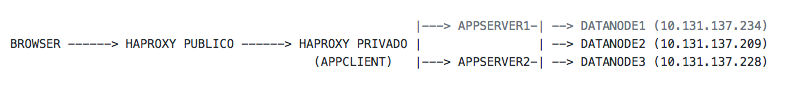

# Herramientas para la Disponibilidad

## Uso de Load Balancer

* Software HAPROXY

      http://www.haproxy.org/

Arquitectura base:

Este LB (HAPROXY), puede tener las siguientes funcionalidades:

* Proxy inverso (permite que un browser en Internet público, pueda ingresar a los servidores AppServer).
* Balanceador de cargas (permite distribuir Requerimientos a los N servidores AppServer)
* Permite recibir comunicaciones seguras (https)

## Caso de estudio:

* HAPROXY Publico (200.12.187.86)
* HAPROXY Privado (10.131.137.219) --> balancea AppServer1 & AppServer2
* Dominio: proyecto17.dis.eafit.edu.co -> apunta a: 200.12.180.86 --> Redirecciona a: 10.131.137.219:8081
* Dominio: proyecto17api.dis.eafit.edu.co -> apunta a: 200.12.180.86 --> Redirecciona a: 10.131.137.219:80/server/ 
* AppClient (10.131.137.219)
* AppServer1 (10.131.137.220)
* AppServer2 (192.168.10.166)

En el AppServer1 hay una app corriendo por el puerto 3000

En el AppServer2 hay otra app corriendo por el puerto 3000

En el AppClient hay una app Angular 2 por el puerto 8081 (NGINX)

Para comprobar el funcionamiento, en un browser entre:

http://10.131.137.220:3000 ,

http://10.131.137.166:3000 y

http://10.131.137.219:8081

En el servidor HAPROXY debe tener previamente instalado haproxy:

* En CentOS:

      $ sudo yum install haproxy

* Configuración en el HAPROXY:

      $ sudo vim /etc/haproxy/haproxy.cfg

Se recomienda usar HAPROXY, porque esto no solo tiene balanceador, sino que para los de seguiridad, les permite activar HTTPS más fácil allí.
